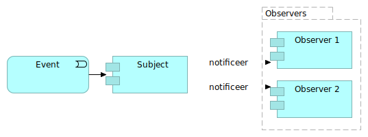

# Terminologie en toelichting

Patroon
: Een ontwerppatroon is de herbruikbare vorm van een oplossing voor een ontwerpprobleem.

> Elk patroon beschrijft een probleem dat zich keer op keer voordoet in onze omgeving, en beschrijft vervolgens de kern van de oplossing voor dat probleem, zodanig dat je deze oplossing een miljoen keer kunt gebruiken, zonder het ooit twee keer op dezelfde manier te doen. - Christopher Alexander

Patronen-taal
: Een georganiseerde verzameling ontwerppatronen die betrekking hebben op een bepaald onderwerp, wordt een patroontaal genoemd. Deze taal geeft een gemeenschappelijke terminologie voor het bespreken van de situaties waarmee ontwerpers worden geconfronteerd.

Gebeurtenis-gedreven architectuur
: Een softwarearchitectuurparadigma dat de productie, detectie, consumptie van en reactie op gebeurtenissen bevordert.

Notificeren
: Het op de hoogte brengen van een partij van een plaatsgevonden gebeurtenis.

# Integratie-stijlen

Notificeren is een mechanisme om integratie tussen applicaties te realiseren door op een afgesproken manier gegevens met elkaar uit te wisselen.
We onderscheiden 4 soorten integratiestijlen:

1. Gedeelde database ('Shared database'): Applicaties delen een database met gemeenschappelijk te gebruiken gegevens.
2. Bestandsuitwisseling ('File transfer'): Applicaties produceren bestanden met gegevens die door andere applicaties worden ingelezen.
3. Externe applicatiefunctionaliteit aanroep ('Remote Procedure Invocation'): Applicaties roepen elkaar via beschikbare interfaces aan om gegevens uit te wisselen.
4. Berichtuitwisseling ('Messaging'): Applicaties wisselen berichten met gegevens met elkaar uit.

Alle vier de integratiestijlen kunnen gebruikt worden om oplossingen voor notificeren mee te realiseren. Ze zijn echter niet allemaal even geschikt en ook niet in alle situaties bruikbaar. Binnen de context van overheidsbreed notificeren geldt voor de verschillende stijlen:

- 'Gedeelde database' stijl is niet bruikbaar omdat betrokken applicaties daarvoor toegang moeten hebben tot dezelfde database. Iets dat vaak onwenselijk of onmogelijk is, zeker als er verschillende organisaties bij betrokken zijn. We laten deze stijl daarom verder buiten beschouwing.
- 'Bestandsuitwisseling' is bruikbaar als er het niet nodig is om snel na het optreden van gebeurtenissen te notificeren en/of als het gaat de uitwisseling van grote hoeveelheden gegevens. In lijn met het uitgangspunt dat we gegevens zoveel mogelijk bevragen bij bronregistraties en onnodig dupliceren van gegevens willen voorkomen is deze stijl voor de meeste situaties onwenselijk.
- 'Externe applicatiefunctionaliteit aanroep' is bruikbaar om te notificeren maar heeft als groot nadeel dat er ongewenste afhankelijkheid tussen applicaties ontstaat. Zo moet de aangeroepen applicatie beschikbaar zijn op het moment van aanroep door de andere applicatie om notificatie succesvol te laten zijn.
- 'Berichtuitwisseling' is in het algemeen de meest wenselijke stijl voor integratieoplossingen. Ook wanneer het oplossingen voor notificeren betreft. Door gegevens in zelfstandig te verwerken berichten te vatten zijn betrouwbare oplossingen te realiseren waarbij betrokken applicaties los van elkaar kunnen functioneren en specialistische functionaliteit bij verschillende applicaties is te beleggen. Zeker wanneer gebruik wordt gemaakt van asynchrone berichtuitwisseling.

## Berichtuitwisseling en type berichten

Bij berichtuitwisseling is onderscheid te maken in verschillende type berichten:

1. Command message: een bericht dat een opdracht bevat voor de ontvangende applicatie (bijv. om een applicatiefunctie uit te voeren).
2. Document message: een bericht dat gestructureerde gegevens zonder opdracht bevat, bedoeld om informatie over te brengen (bijv. statusinformatie over een plaatsgevonden verwerking)
3. Event message: een bericht waarin gegevens over een plaatsgevonden gebeurtenis zijn opgenomen. In tegenstelling tot een document-message waarbij informatieoverdracht centraal staat is de primaire functie om kort na het optreden van een gebeurtenis ontvangende applicaties daarvan in kennis te stellen.

Berichten kunnen van 1 type zijn of een combinatie daarvan. Zo kan een bericht bijv. gegevens bevatten dat de prijs van een product is verhoogd (event-message), maar ook artikelgegevens, inclusief de nieuwe prijs, bevatten (document-message).

In lijn met het uitgangspunt om in situaties waarin vertrouwelijke gegevens zijn betrokken informatie-arm te notificeren is het wenselijk om gebruik te maken van event-messages. Hiermee gerealiseerde data-minimalisatie en uitvoering van authenticatie- en autorisatiecontroles bij opvraging uit bronregisters leidt tot beterer beveiliging en privacywaarborgen.

## Notificatie patronen

Voor het notificeren van applicaties zijn verschillende patronen beschikbaar. We richten ons hier met name op patronen waarbij gebruik wordt gemaakt van berichtuitwisseling als integratiestijl.
Binnen patronen is onderscheid te maken in basispatronen en uitgewerkte patronen die voortbouwen op basispatronen. Hieronder worden eerste enkele basispatronen beschreven die zelfstandig of in combinatie met andere patronen zijn te gebruiken voor oplossingen om te notificeren.

### Basispatronen

De beschrijving van basispatronen is grotendeels gebasserd op het boek 'Design Patterns: Elements of Reusable Object-Oriented Software' softwareontwerppatronen worden beschreven. Het betreft daarbij de ontwerppatronen die specifiek betrekking hebben op de communicatie tussen objecten.

#### Observer patroon

Functie: Het kunnen notificeren van applicaties waarbij applicaties los gekoppeld zijn.
Synoniem: publish-subscribe

> The Observer pattern describes how to establish these relationships.The key objects in this pattern are subject and observer. A subject may have any number of dependent observers. All observers are notified whenever the subject undergoes a change in state. In response, each observer will query the subjectto synchronize its state with the subject's state.
> Opmerkingen:

- Bij voorkeur hoeft het subject alleen plaatsgevonden gebeurtenissen te melden zonder kennis te hebben van het feit of, en zo ja hoeveel en welke, observers er zijn
- Naar aanleiding van een notificatie kunnen observers al dan niet meer informatie opvragen bij het subject
- De feitelijke notificering van observers hoeft niet altijd door het subject zelf te worden uitgevoerd ('brokering')
- Het triggeren van notificeren kan zowel door subject als observer worden gedaan ('push vs pull').
- Een subject moet garanderen dat de eigen status consistent is voor notificeren als opvraging n.a.v. notificatie mogelijk is.
- Notificeren kan efficienter verlopen als observers specificeren voor welke gebeurtenissen ('aspects') zij genotificeerd willen worden
- Als het notificeren van observers (te) complex wordt kan een apart object ('change manager') worden ingeschakeld; er is dan sprake van een ChangeManager-gebaseerde implementatie van het Observer patroon.
- Voorbeelden van gebruik van het Observer patroon zijn het Model-View-Controller model bij bij softwareontwikkeling en Publish-Subscribe mechanismen voor notificatie

[[https://github.com/adgerrits/notificatiepatronen/blob/main/img/observer.png|alt=observer]]

####

# Notificatie patronen
